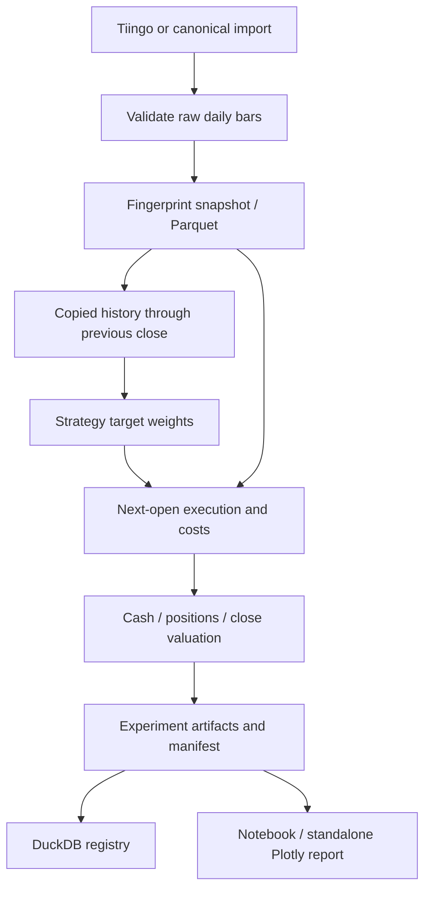

# Architecture

The canonical dataset stores raw prices and explicit action fields, never backward-adjusted execution prices. A forward-only total-return index feeds momentum. Calendar labels use XNYS trading sessions; they are not wall-clock timestamps. The adapter converts the provider's documented UTC date labels to these labels and persists its source conventions.

The engine slices and copies only the history ending before the current session. Strategies receive that prefix and the explicitly static universe. They never receive the engine, dataset, cash account or execution-day prices. New-month orders target next-open portfolio weights using next-open sizing, an explicit idealized rebalance assumption; they are not precommitted share counts. Raw open pricing is therefore execution input, not signal input. This open-sizing idealization must be replaced for realistic auction execution research.

Daily order: previous-close signal if scheduled; corporate actions on overnight holdings; raw open valuation; solve post-cost capital; sales; purchases; raw close marks; P&L reconciliation; save cash, holdings and costs. A final pending signal is not fabricated or executed outside the requested range. Current-day volume is only an execution feasibility check, never a signal filter. This is not an intraday liquidity model.

Average cost excludes fees; costs have their own cumulative ledger. Net P&L = realized trading P&L + unrealized trading P&L + cash distributions − costs. NAV equals cash plus raw-price holdings. Split quantities multiply and basis divides. Dividend cash is credited before trading on ex-date; simultaneous splits/dividends fail because entitlement conventions differ.

The complete rectangular panel restriction is intentional and exposed. No stale-price carry-forward, inferred liquidation, membership backfill, or removal of failed securities. Dynamic membership is unsupported and rejected by the strict configuration; a future membership implementation must carry effective and known-at times and corresponding adversarial tests.

Configuration is Pydantic-validated YAML. Results are Parquet; metadata, metrics and artifact hashes are JSON. Experiments write into a staging directory, render the report, then atomically rename into the registry namespace. Failed runs do not appear as completed experiments. UUIDs identify runs; the content fingerprint identifies data, and the package source hash identifies installed Python source even in a dirty working tree. Parent IDs and sweep purposes expose repeated variants. Download timestamps deliberately affect provenance fingerprints even when returned prices are identical.

Snapshots are retained once by content/provenance hash. Experiments record a concrete snapshot path and hash; they do not duplicate datasets. Registry is an in-memory DuckDB analytical query over persisted metadata. Data files are authoritative; no database migrations or server are necessary. Concurrent creation of the exact same dataset directory and concurrent append to a single robustness batch are not supported in V0; run these operations serially.

Strategy and provider interfaces are small protocols. Reporting consumes completed artifacts. Robustness reuses the ordinary experiment runner with validated variant configurations and retains all runs. No optimization objective or best-variant selector exists.
